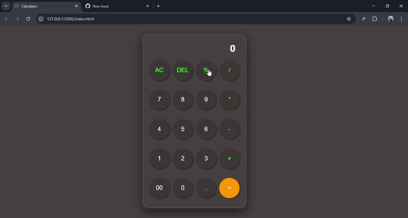

# 🔢 Modern Calculator Web App

A fully functional calculator** built using **HTML, CSS, and JavaScript**. This project includes a modern UI with smooth button interactions and essential calculator functionalities.

## 🚀 Live Demo



## ✨ Features
- 🖥️ **Basic Arithmetic Operations**: Addition, Subtraction, Multiplication, Division.
- 🔢 **Percentage (%) Calculation**.
- 🧹 **AC (All Clear)**: Resets the calculator.
- 🔙 **DEL (Delete)**: Removes the last entered digit.
- 🎨 **Modern UI Design** with a sleek dark theme.


## 🛠️ Technologies Used
- **HTML** → Structure of the calculator.
- **CSS** → Styling and UI design.
- **JavaScript** → Handles calculator logic.


## 📂 Project Setup
Follow these steps to run the project locally:

1. **Clone the repository**  
   ```bash
   git clone https://github.com/ishanbista/javascript-calculator
2. **Navigate into the project folder <br>
   cd calculator
4. Open index.html in your browser 
## 🏆 Contributing <br>
Have suggestions or found a bug? Feel free to fork this repo and submit a pull request!
 
